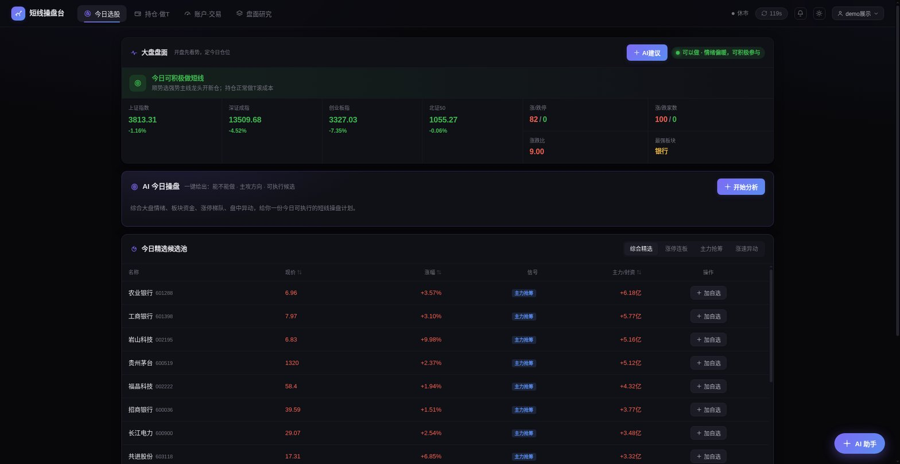
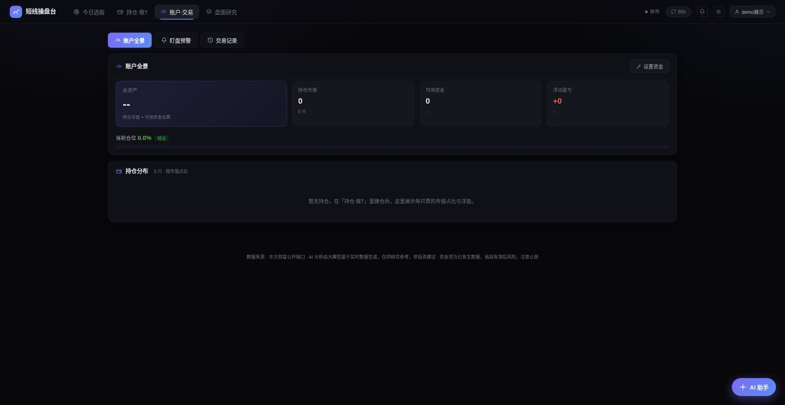
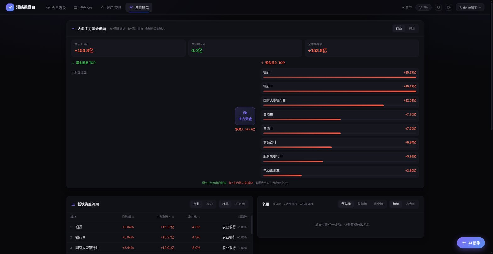
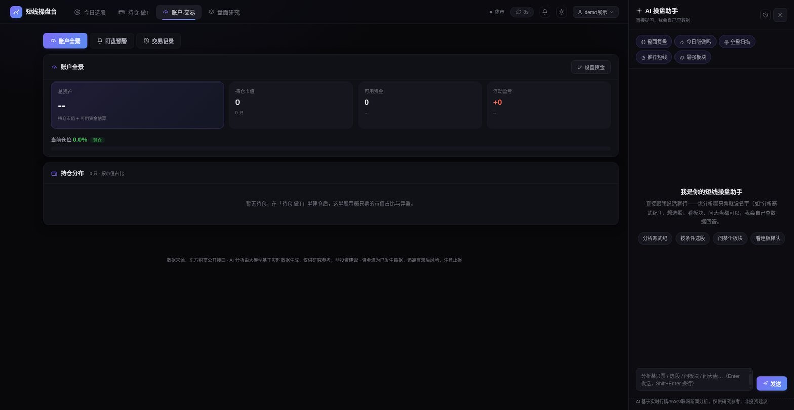

# 📈 短线操盘台 · A股短线 / 做T 交易决策系统

> 一个面向 A 股短线与做 T 场景的 **AI 交易决策 + 纪律执行工作台**。经多轮深度迭代，已从「行情看板」升级为覆盖 **选股 → 建仓/做T → 盯盘预警 → 仓位纪律 → 交易复盘** 的完整操盘闭环——不只告诉你「今天能不能做、做什么」，更帮你把交易理论落成**可执行、可监控、可复盘**的买卖纪律。

前端 React + Vite，后端 Vercel Serverless Functions，行情来自东方财富公开接口，AI 能力由大模型（Function Calling Agent + RAG）驱动。

> ⚠️ 定位为**决策 / 纪律 / 复盘**工具，**不做真实下单**——下单仍在券商 App 完成。所有分析仅供研究参考，非投资建议。

---

## 🖼 界面预览

> 完整设计理念、信息架构与数据流见 **[docs/DESIGN.md](docs/DESIGN.md)**。

| 今日选股 | 账户 · 交易 |
|---|---|
|  |  |
| **盘面研究** | **AI 操盘助手** |
|  |  |

---

## ✨ 核心功能

| 模块 | 能力 |
|---|---|
| **今日选股** | 大盘全景（四大指数+情绪红绿灯）、**市场情绪温度计**（涨停/炸板率/最高板/连板/跌停 → 综合评分）、AI 今日操盘建议、精选候选池（涨停/主力抢筹/涨速多信号合成）、涨停连板池 |
| **持仓 · 做T** | 建仓/加仓/减仓/清仓；**做 T** 独立抽屉（AI 低吸/高抛价位建议、流水式记录、FIFO 自动配对算差价、含费买卖均价、手动/次日自动结算）；**「踏5不破10」策略信号灯**（自动比对现价与 MA5/MA10、量价、盈亏，给持有/低吸/减仓/清仓/止损信号）；**交易计划**（AI 参考技术面+理论生成止盈/止损价，触及即预警） |
| **账户 · 交易** | 三合一融合页 ——「账户全景」（总资产/仓位%/浮盈/持仓分布/单票超配预警）、「盯盘预警」（到价/涨跌幅/量比/换手/涨跌停临近，命中即浏览器通知+响铃）、「交易记录」（按时间/按个股双视角、分类统计、**绩效归因**：胜率/盈亏比/每笔期望值、CSV 导出） |
| **盘面研究** | **大盘主力资金流向图**（左出→中枢→右入，红入绿出）、板块/成分股下钻（表头排序 + 热力图视图）、板块近 10 日资金趋势、盘中异动 |
| **个股详情** | 分时图（VWAP 均价线+昨收基准）/ K线切换、MA5/10/20/60 数值 + **金叉死叉/多空排列等技术参考结论**、公司简介（参考网址可点击）、一键把股票信息+建议问题预填进 AI 助手 |
| **AI 助手** | 工具增强 Agent，自主多轮调用行情/选股/板块/涨停/异动/情绪/新闻，结合经典交易理论 RAG 给出「数据+理论」双支撑分析；对话按日期持久化、单日上下文连贯、可停止分析 |
| **云端账号** | 昵称+密码登录，交易/计划/预警数据云端存储、跨设备同步；支持白天/夜间主题切换 |

---

## 🧠 AI 能力设计

- **工具增强 Agent（Function Calling）**：AI 助手自主决定调用哪些工具、调几轮 —— 查行情、选股筛选、板块资金、涨停连板、盘中异动、大盘情绪、联网新闻，多轮后综合作答。
- **AI 交易计划定价**：设计划时由 LLM 结合 MA5/10/20、近 20 日支撑压力、当日分时 VWAP、量价与持仓成本，参考均线/支撑压力/量价/趋势理论，给出个股**止盈/止损价 + 定价依据**，用户可再改。
- **投资理论 RAG**：将道氏理论、缠论、量价关系、龙头战法、市场情绪周期、仓位与风控等经典交易体系蒸馏为知识库，向量检索（BGE-m3）按问题召回注入上下文，标注引用出处、降低幻觉。
- **策略规则引擎（本地）**：「踏5不破10」买卖法则化 —— 用日K均线 + 量能实时判定信号灯，不占接口、盘中即时更新。
- **结构化决策**：今日操盘、盘面复盘、做T建议、交易计划等以 JSON 模式输出，前端渲染成卡片。

---

## 🛠 技术栈

- **前端**：React 18、Vite 5、ECharts（K线/分时/热力图）、纯 CSS 资金流向图
- **后端**：Vercel Serverless Functions（Node.js）
- **数据**：东方财富公开行情接口（服务端代理、多镜像容错）
- **AI**：兼容 OpenAI 格式的 LLM 网关（Chat + Function Calling + Embeddings）
- **存储**：Vercel Blob（云端账号数据）+ 浏览器 localStorage（会话/本地兜底）
- **健壮性**：盘面各模块 ErrorBoundary 隔离，单模块异常不拖垮整页

---

## 📂 目录结构

```
.
├── api/                  # Serverless 后端函数（生产由 Vercel 托管）
│   ├── _lib.js           # 东财请求 / 响应工具（下划线=共享模块，不占函数额度）
│   ├── _rag.js _kb.js    # RAG 语料构建 + 向量检索 / 投资理论知识库
│   ├── _screen.js        # 选股筛选核心逻辑
│   ├── agent.js          # AI 助手（工具增强 Agent）
│   ├── ai.js             # 结构化 AI（今日操盘/盘面复盘/做T建议/交易计划定价）
│   ├── account.js        # 云端账号（注册/登录/数据同步）
│   ├── board.js          # 涨停池 + 盘中异动（合并接口，省函数额度）
│   ├── market.js sectors.js quote.js search.js  # 各类行情
│   └── stock_detail.js sector_history.js stocks.js  # 详情(K线+分时)/板块历史/成分股
├── src/
│   ├── App.jsx           # 主框架 + Tab 路由 + 登录门户 + 预警轮询
│   ├── components/       # 各页面与组件（AccountHub/AlertPanel/PlanTab/StockDetail…）
│   ├── planStore.js      # 交易账本（计划/持仓/交易记录/做T/账户/预警规则）
│   ├── alertStore.js     # 盯盘预警引擎（命中判定+通知+响铃）
│   ├── authStore.js      # 云端账号状态
│   ├── aiStore.js chatStore.js detailStore.js themeStore.js  # 全局状态
│   └── styles.css        # 全站样式（Linear 风格，支持暗色/白天主题）
├── dev-server.js         # ★本地开发 API 服务器（把 api/ 挂成本地路由）
├── vite.config.js        # 前端配置（/api 代理到本地 3000）
├── vercel.json           # Vercel 部署配置
└── .env.example          # 环境变量示例
```

---

## 🚀 本地运行

```bash
# 1. 克隆
git clone https://github.com/anthony67158/Short-term-stock-trading.git
cd Short-term-stock-trading

# 2. 安装依赖
npm install

# 3. 配置环境变量（不配 AI 变量时行情可用，但 AI 助手/做T/计划定价不可用）
cp .env.example .env.local
# 编辑 .env.local，至少填 LLM_BASE_URL / LLM_API_KEY / AGENT_MODEL

# 4. 启动（需要两个终端）
npm run dev:api   # 终端 A：本地 API 服务器（端口 3000）
npm run dev       # 终端 B：前端 Vite（默认 5173，已把 /api 代理到 3000）
```

浏览器打开 **http://localhost:5173** 即可使用。

> **说明**：`api/` 是 Vercel Serverless 函数，本地用 `dev-server.js` 挂载成 `http://localhost:3000/api/*`，Vite 再把 `/api` 请求代理过去，从而在本机完整跑起来。
>
> ⚠️ 东方财富行情接口在**部分网络环境**下可能无法直连（海外/受限网络），若行情为空属正常，部署到 Vercel 海外节点则可正常获取。

---

## ☁️ 部署到 Vercel

1. 在 [Vercel](https://vercel.com) 导入本仓库。
2. **Settings → Environment Variables** 配置 `.env.example` 中的变量。
3. （可选）云端账号功能：在 Vercel 创建 **Blob Store** 并连接到项目，会自动注入 `BLOB_READ_WRITE_TOKEN`。
4. Vercel 自动识别 Vite 构建与 `api/` 函数，一键部署。

> 注意：Vercel Hobby 计划 Serverless 函数上限为 **12 个**；本项目通过合并接口（如 `board.js` 合并涨停池+异动）与下划线共享模块控制在额度内，新增后端能力时请优先复用/合并。

---

## ⚙️ A股手续费模型（做T/交易记录内置）

- 佣金：万 3，最低 5 元（买卖双向）
- 印花税：千 0.5（仅卖出）
- 过户费：万 0.1（买卖双向）

做 T 采用 **FIFO 配对**计算已实现差价；均价均为**含费均价**（买入均价含买费、卖出均价扣卖费）；成本/浮盈展示均为**含费口径**，价格**原样显示不做四舍五入**，更贴近真实成本与所得。

---

## 📌 免责声明

本项目为个人技术项目，所有 AI 分析与数据均基于公开行情、**仅供研究与学习参考，不构成任何投资建议**，且**不提供真实下单能力**。据此交易，风险自负。

---

## 📄 License

MIT
